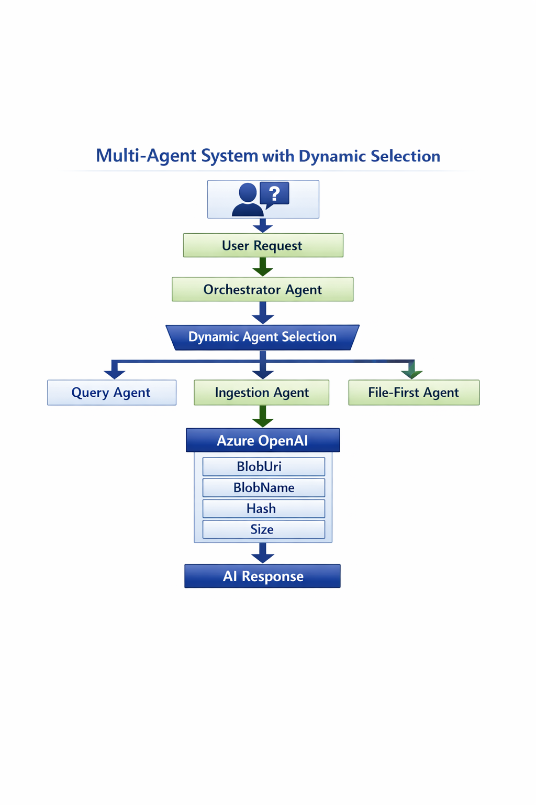
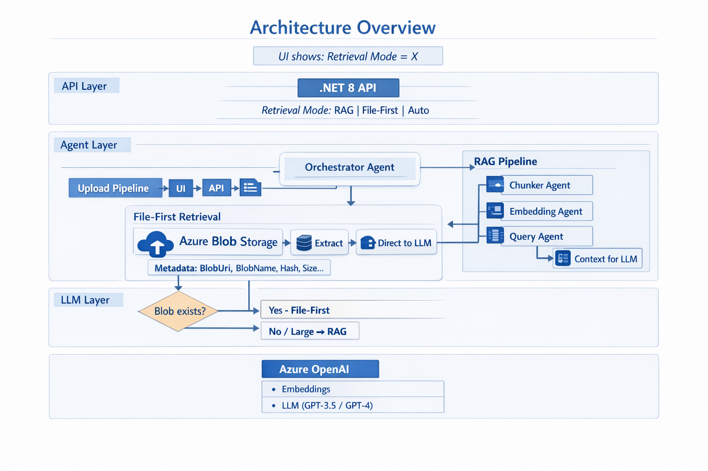
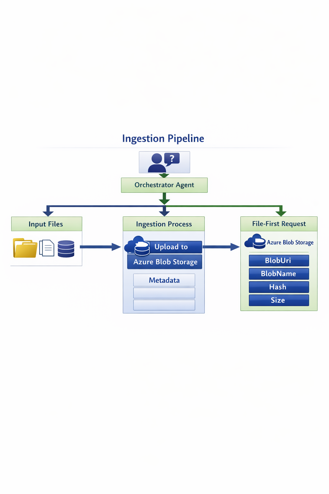
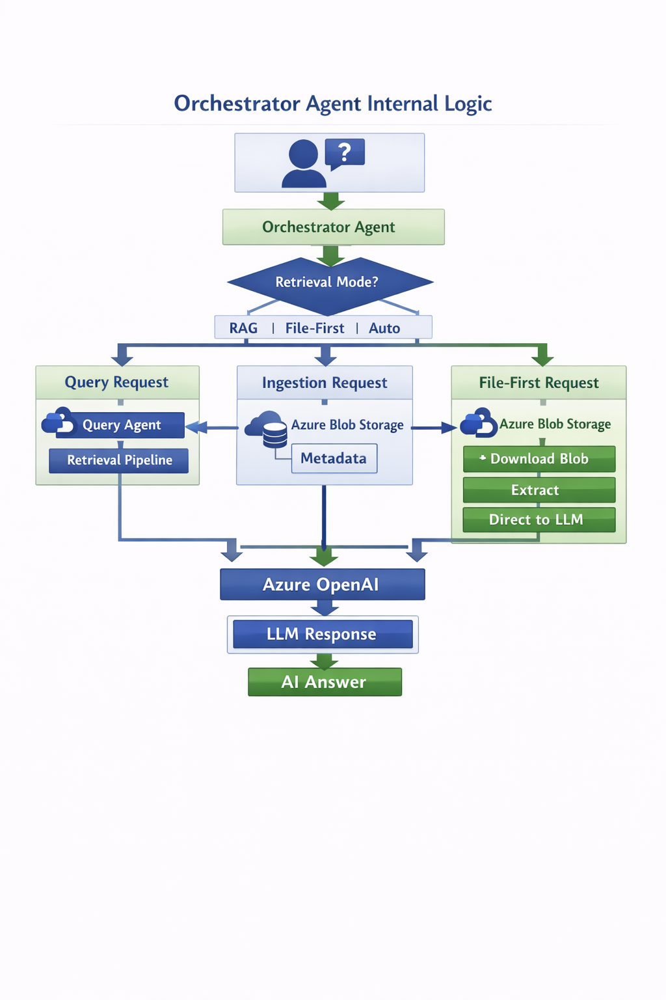
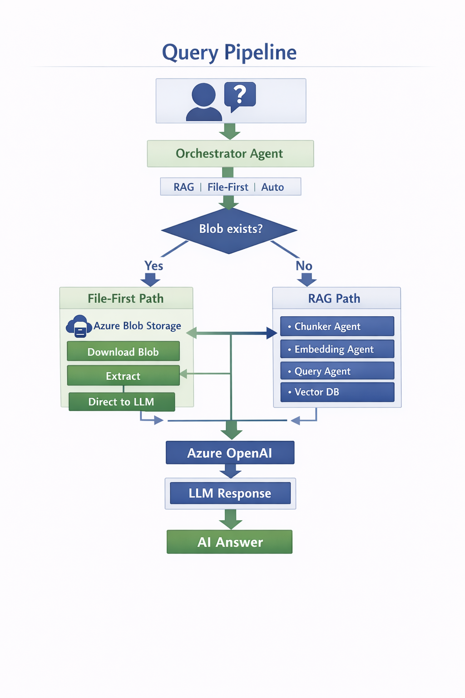
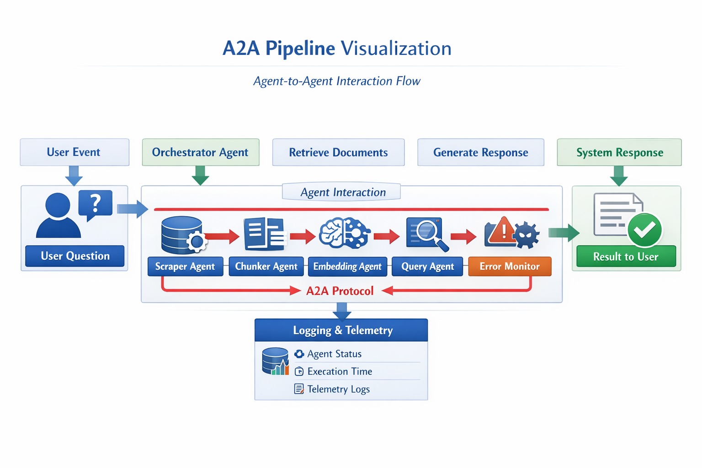
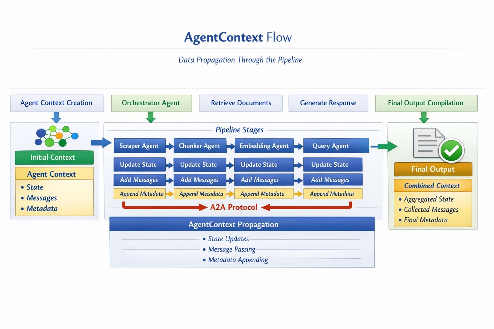

# RAG Agent API

A sophisticated **multi-agent Retrieval-Augmented Generation (RAG) system** built with ASP.NET Core 8.0, featuring **PostgreSQL+pgvector** for vector storage and **dynamic agent selection** for intelligent document processing and querying.

## 🏗️ Architecture

### Multi-Agent System with Dynamic Selection
The API implements an **enhanced multi-agent architecture** where specialized agents are **dynamically selected** based on content type:



#### Core Pipeline Agents
- **OrchestratorAgent**: **Enhanced** coordinator with dynamic agent selection and pipeline execution
- **ScraperAgent**: Extracts and cleans content from web URLs using HtmlAgilityPack
- **ChunkerAgent**: Intelligently splits content into overlapping chunks with sentence boundary preservation
- **EmbeddingAgent**: Generates vector embeddings using Azure OpenAI text-embedding-ada-002
- **PostgresStorageAgent**: **NEW** - Stores documents and embeddings in PostgreSQL with pgvector
- **PostgresQueryAgent**: **NEW** - Handles queries with PostgreSQL vector similarity search

#### Specialized Content Agents
- **GitHubApiAgent**: **NEW** - Specialized for GitHub repositories, files, and documentation
- **YouTubeTranscriptAgent**: **NEW** - Extracts video metadata and transcripts from YouTube
- **ArxivScraperAgent**: **NEW** - Processes academic papers from arXiv with PDF support
- **NewsArticleScraperAgent**: **NEW** - Optimized for news articles and blog posts

#### Legacy Agents (Deprecated)
- **StorageAgent**: Legacy Azure Search storage (replaced by PostgresStorageAgent)
- **QueryAgent**: Legacy Azure Search queries (replaced by PostgresQueryAgent)

### Database & Storage Architecture
- **PostgreSQL 16 + pgvector**: **Primary vector database** with cosine similarity search
- **Azure OpenAI Service**: Text embeddings and chat completions (GPT-3.5-turbo)
- **Azure AI Search**: Legacy vector storage (being phased out)
- **Application Insights**: Comprehensive telemetry and monitoring

### Agent Selection System
- **AgentSelectorService**: **NEW** - Automatically selects optimal agent based on URL patterns
- **AgentFactory**: **NEW** - Dynamically creates agent pipelines from database configuration
- **URL Pattern Matching**: Regex-based routing (GitHub → GitHub agent, YouTube → YouTube agent, etc.)

## 🧱 Architecture Overview

This updated architecture diagram reflects the new Blob‑based File‑First retrieval logic.
The API layer now supports three retrieval strategies: RAG, File‑First, and Auto.
The Auto mode selects the optimal path based on Blob existence and file characteristics.

The diagram shows both retrieval pipelines:
– The File‑First path (Blob Storage → Download Blob → Extract → Direct to LLM), including metadata such as BlobUri, BlobName, Hash, and Size.
– The RAG pipeline (Chunker, Embedding, Query Agents, Vector DB, and context construction).

The UI continues to display the active retrieval mode, ensuring transparency for end users.



## 🔄 Ingestion Pipeline

Update Ingestion Pipeline diagram as follows:
The ingestion pipeline now shows the full data processing flow:
– Input files are ingested through the 'Ingestion Process' where they undergo preprocessing.
– Metadata including BlobUri, BlobName, Hash, and Size is added during the upload step to Azure Blob Storage.



## 🧠 OrchestratorAgent Internal Logic

This updated Orchestrator Agent Internal Logic diagram illustrates how the orchestrator manages different request types:
– Query Requests: The orchestrator selects the Query Agent and triggers the retrieval pipeline based on RAG, File-First, or Auto mode.
– Ingestion Requests: The orchestrator processes and stores incoming data into Azure Blob Storage with metadata saved alongside.
– File-First Requests: For small files or simple retrievals, the orchestrator downloads the file from Blob Storage, extracts the content, and sends it directly to the LLM.

All paths converge at Azure OpenAI, where the LLM generates the final response.



## 🔍 Query Pipeline

This updated Query Pipeline diagram reflects the new Blob‑based File‑First retrieval logic.
The orchestrator now supports three retrieval strategies: RAG, File‑First, and Auto.
The Auto mode selects the optimal path based on Blob existence and file characteristics.

The diagram shows both retrieval pipelines:
– The File‑First path (Blob Storage → Download Blob → Extract → Direct to LLM), optimized for cases where the file already exists in Blob Storage.
– The RAG pipeline (Chunker Agent, Embedding Agent, Query Agent, Vector DB, and context construction), used when no Blob exists or when the file is large.

Both paths converge at Azure OpenAI, where the LLM generates the final response.



## 🔁 A2A Pipeline

This diagram visualizes the Agent‑to‑Agent (A2A) communication pipeline.
The OrchestratorAgent selects the required agents and initiates the workflow.
Each agent communicates directly with the next using the A2A protocol, passing context, results, and status updates.
The Scraper, Chunker, Embedding, Query, and ErrorMonitor agents form a dynamic interaction chain where each step can influence the next.
All messages and execution metrics are recorded in the logging and telemetry system, enabling real‑time monitoring and full pipeline traceability.
The final processed result is returned to the user after all agent interactions are complete.



## 🧬 AgentContext Flow

This diagram illustrates how the `AgentContext` object flows through each stage of the agent pipeline.

The OrchestratorAgent creates the initial context, which includes three key components:
- **State** — shared data passed between agents
- **Messages** — communication history and agent outputs
- **Metadata** — execution details, diagnostics, and agent-specific information

As the pipeline progresses, each agent updates the context:
- **ScraperAgent** adds raw content and scraping metadata
- **ChunkerAgent** splits content and appends chunking information
- **EmbeddingAgent** generates vector embeddings and stores embedding metadata
- **QueryAgent** performs semantic search and adds retrieval metrics

At the final stage, the system compiles the aggregated context into a unified result, which is returned to the user.



## 🚀 Features

### Enhanced Core Capabilities
- ✅ **Dynamic Agent Selection**: Automatic agent routing based on content type
- ✅ **Specialized Content Processing**: GitHub, YouTube, arXiv, News optimizations
- ✅ **PostgreSQL Vector Storage**: High-performance pgvector with IVFFlat indexing
- ✅ **Web Content Ingestion**: Scrape and process content from any URL
- ✅ **Intelligent Chunking**: Preserve semantic meaning with sentence-aware splitting
- ✅ **Vector Embeddings**: High-quality embeddings using Azure OpenAI ada-002
- ✅ **Semantic Search**: PostgreSQL cosine similarity search with metadata
- ✅ **RAG Generation**: Context-aware answer generation with source tracking
- ✅ **Conversation Management**: Full conversation history with PostgreSQL
- ✅ **Pipeline Analytics**: Complete execution tracking and performance metrics

### Advanced Features
- ✅ **URL-Based Agent Routing**: Automatic selection of specialized agents
- ✅ **Database-Driven Configuration**: Agent types and URL mappings stored in PostgreSQL
- ✅ **Execution Analytics**: Comprehensive pipeline performance tracking
- ✅ **Similar Query Detection**: Find related past queries using vector similarity
- ✅ **Agent Pipeline Orchestration**: Sequential agent execution with error handling
- ✅ **Enhanced API Endpoints**: Both legacy and enhanced processing modes
- ✅ **Retrieval Strategies**: Configurable Rag/FileFirst/Auto modes with strategy pattern

### Quality & Reliability
- ✅ **Production Ready**: Error handling, retries, and graceful degradation
- ✅ **Comprehensive Testing**: Unit tests with xUnit and Moq
- ✅ **API Documentation**: OpenAPI/Swagger with detailed schemas
- ✅ **Health Monitoring**: Service health checks and dependency validation
- ✅ **Background Services**: Automatic context cleanup and database maintenance

## 📋 Prerequisites

### Required Software
- .NET 8.0 SDK
- PostgreSQL 16 with pgvector extension
- Docker (for PostgreSQL container)

### Azure Services
- Azure OpenAI Service (text-embedding-ada-002, gpt-35-turbo deployments)
- Azure AI Search instance (legacy, optional)
- Azure Blob Storage account (optional)
- Azure Document Intelligence service (optional)
- Application Insights instance (optional)

### Database Setup
The system uses **PostgreSQL 16 with pgvector** as the primary database:

```bash
# Run PostgreSQL with pgvector using Docker
docker run -d \
  --name ragagentdb \
  -e POSTGRES_PASSWORD=YourPassword \
  -p 5433:5432 \
  pgvector/pgvector:pg16
```

## ⚙️ Configuration

**⚠️ Security First:** Never commit API keys to Git!

### Quick Setup
1. Copy template configuration files:
```bash
cp appsettings.json.template appsettings.json
cp appsettings.Development.json.template appsettings.Development.json
```

2. Update configuration files with your service endpoints and keys:
   - See `SETUP.md` for detailed instructions
   - Replace all `YOUR_*` placeholders with actual values

### Required Configuration
```json
{
  "ConnectionStrings": {
    "PostgreSQL": "Host=localhost;Port=5433;Database=ragagentdb;Username=postgres;Password=YourPassword"
  },
  "Azure": {
    "OpenAI": {
    "Endpoint": "https://your-openai.openai.azure.com/",
      "Key": "your-openai-key",
      "EmbeddingDeployment": "text-embedding-ada-002",
  "ChatDeployment": "gpt-35-turbo"
    }
  },
  "RagSettings": {
    "Mode": "hybrid"
  }
}
```

### RAG Modes

The API supports two operational modes for handling queries without document context:

#### Hybrid Mode (Default: `"hybrid"`)
- **With documents**: Uses RAG with document context
- **Without documents**: Falls back to ChatGPT general knowledge
- **Best for**: Interactive chatbots that should always provide helpful answers
- **User experience**: Clearly indicates when answering without documents

#### Strict Mode (`"strict"`)
- **With documents**: Uses RAG with document context
- **Without documents**: Returns error message requiring document ingestion
- **Best for**: Applications requiring only fact-based answers from ingested documents
- **User experience**: Ensures no hallucination or general knowledge mixing

**Configuration:**
```json
{
  "RagSettings": {
    "Mode": "hybrid",  // or "strict"
    "DefaultChunkSize": 1000
  }
}
```

### Retrieval Strategies

The API supports three **retrieval strategies** that determine how documents are fetched and used to answer queries. This is configured separately from RAG Modes and controls the document retrieval mechanism.

#### Strategy Pattern Architecture

```
┌─────────────────────────────────────────────────────────────┐
│                  RetrievalStrategyFactory                   │
│         (Reads config and returns correct strategy)         │
└─────────────────────────┬───────────────────────────────────┘
                          │
          ┌───────────────┼───────────────┐
          ▼               ▼               ▼
   ┌──────────────┐ ┌──────────────┐ ┌──────────────┐
   │     Rag      │ │  FileFirst   │ │     Auto     │
   │   Strategy   │ │   Strategy   │ │   Strategy   │
   └──────────────┘ └──────────────┘ └──────────────┘
   │ Vector search │ │ Load all docs│ │ Selects Rag  │
   │ via pgvector  │ │ from database│ │ or FileFirst │
   └───────────────┘ └──────────────┘ └──────────────┘
```

#### Available Strategies

| Strategy | Description | Best For |
|----------|-------------|----------|
| **Rag** | Uses vector similarity search (pgvector) to find relevant document chunks | Large document collections, semantic search |
| **FileFirst** | Loads all documents directly from the database | Small collections (≤10 docs, ≤500KB total) |
| **Auto** | Automatically selects between Rag and FileFirst based on document count and size | Mixed workloads, automatic optimization |

#### Rag Strategy (Default)
- Generates embedding for the query using Azure OpenAI
- Performs cosine similarity search against document chunks
- Returns only the most relevant chunks as context
- **Pros**: Efficient for large collections, semantic understanding
- **Cons**: May miss context if chunks are too small

#### FileFirst Strategy
- Loads all active documents and their chunks from PostgreSQL
- Provides complete document context to the LLM
- **Pros**: Complete context, no relevance filtering
- **Cons**: Token limit issues with large collections

#### Auto Strategy
- Checks document count and total content size
- If documents ≤ threshold AND content size ≤ threshold → **FileFirst**
- Otherwise → **Rag**
- **Pros**: Best of both worlds, adapts to data size
- **Cons**: Slight overhead from size calculation

#### Configuration

```json
{
  "Retrieval": {
    "Mode": "Rag",                        // "Rag", "FileFirst", or "Auto"
    "AutoModeDocumentThreshold": 10,      // Max docs for FileFirst in Auto mode
    "AutoModeContentSizeThresholdKb": 500, // Max content size (KB) for FileFirst
    "MinimumRelevanceScore": 0.5          // Min similarity score for Rag results
  }
}
```

#### UI Indicator

The Blazor UI displays the current retrieval mode in the header:
- 🔍 **RAG** - Vector similarity search active
- 📁 **FileFirst** - Direct document loading active
- 🔄 **Auto** - Automatic strategy selection

#### API Endpoint

Get current retrieval configuration:
```bash
curl https://localhost:7000/api/rag/retrieval-config
```

Response:
```json
{
  "mode": "Auto",
  "autoModeDocumentThreshold": 10,
  "autoModeContentSizeThresholdKb": 500,
  "minimumRelevanceScore": 0.5
}
```

#### Startup Logging

When the application starts, it logs the selected retrieval strategy:
```
[RetrievalStrategy] Configured retrieval mode: Auto
```

## 🚀 Getting Started

### 1. Database Setup
```bash
# Start PostgreSQL with pgvector
docker run -d --name ragagentdb -e POSTGRES_PASSWORD=YourPassword -p 5433:5432 pgvector/pgvector:pg16

# The application will automatically:
# - Create database schema with Entity Framework migrations
# - Seed initial agent types and URL mappings
# - Set up vector indexes for optimal performance
```

### 2. Run the Application
```bash
dotnet restore
dotnet build
dotnet run
```

Navigate to `https://localhost:7000` for Swagger UI.

### 3. Test the Enhanced API

#### Enhanced Content Ingestion (Recommended)
```bash
curl -X POST "https://localhost:7000/api/Rag/ingest-enhanced" \
  -H "Content-Type: application/json" \
  -d '{
    "url": "https://github.com/microsoft/semantic-kernel",
    "chunkSize": 1000,
    "chunkOverlap": 200
  }'
```

**Response includes agent selection:**
```json
{
  "thread_id": "...",
  "agent_type": "github_specialist",
  "pipeline_agents": ["GitHubApiAgent", "ChunkerAgent", "EmbeddingAgent", "PostgresStorageAgent"],
  "chunks_processed": 15,
  "execution_time_ms": 3500,
  "enhanced_processing": true
}
```

#### Query with PostgreSQL
```bash
curl -X POST "https://localhost:7000/api/Rag/query" \
  -H "Content-Type: application/json" \
  -d '{
    "query": "What is Semantic Kernel?",
    "topK": 5
  }'
```

## 📊 Agent Types & URL Routing

The system automatically selects specialized agents based on URL patterns:

| URL Pattern | Agent Type | Specialization |
|-------------|------------|----------------|
| `github.com/*` | **GitHubApiAgent** | Repository analysis, README extraction, code structure |
| `youtube.com/*` | **YouTubeTranscriptAgent** | Video metadata, transcript extraction, timestamps |
| `arxiv.org/*` | **ArxivScraperAgent** | Academic papers, PDF processing, citations |
| `news/*`, `blog/*` | **NewsArticleScraperAgent** | Article content, author detection, publication dates |
| `*` (fallback) | **DefaultAgent** | General web scraping with ScraperAgent |

## 🗄️ Database Schema

The system uses PostgreSQL with the following key tables:

### Vector Storage
- **Documents**: URL-level metadata and full content
- **DocumentChunks**: Text chunks with 1536-dimensional vectors
- **Messages**: Query history with embeddings for similarity search

### Agent Management
- **AgentTypes**: Available agent configurations and pipelines
- **UrlAgentMappings**: URL pattern → Agent type routing rules
- **AgentExecutions**: Complete pipeline execution history and analytics

### Conversation Tracking
- **Conversations**: User conversation sessions
- **Messages**: All messages with embeddings for similar query detection

## 🎯 Demo Services

The API includes **4 standalone demo services** for demonstrating AI/ML capabilities without affecting the RAG pipeline.

### Available Demos
- **Classification**: Text sentiment classification with 20 training samples
- **Time-Series**: Forecasting and trend analysis with statistical metrics
- **Image Processing**: Image generation and color analysis (256x256 PNG)
- **Audio Processing**: Signal analysis with frequency detection (440Hz WAV)
- **A2A Pipeline** (NEW): Real-time Agent-to-Agent communication visualization

### Demo Endpoints

```bash
# Get available demos
curl https://localhost:7000/api/demo/available

# Generate test data
curl -X POST https://localhost:7000/api/demo/generate-testdata?demoType=classification

# Run demo
curl -X POST https://localhost:7000/api/demo/run?demoType=classification
```

### Demo Results
Each demo returns structured results with execution metrics:

```json
{
  "demoType": "classification",
  "success": true,
  "message": "Classification demo completed successfully",
  "data": {
    "total_samples": 20,
    "label_distribution": {"positive": 10, "negative": 10},
    "model_accuracy": "92.00%",
    "classes_found": ["positive", "negative"]
  },
  "executionTimeMs": "2ms"
}
```

### Test Data Storage
Generated demo files are stored in `demos/` directory:
```
demos/
├── classification/data/classification_training.csv
├── time-series/data/timeseries_data.csv
├── image-processing/data/test_image.png
└── audio-processing/data/test_audio.wav
```

### Test Data Repository Pattern

Demo services now support **flexible, configurable data sourcing**:

- **Local Files** (default): Fast access, development-friendly
- **PostgreSQL**: Persistent storage, history tracking, analytics
- **Hybrid**: Both simultaneously for maximum flexibility

**Configuration:**
```json
{
  "DemoSettings": {
    "DataSource": "local",  // "local" or "postgres"
    "LocalDataPath": "demos/",
    "SaveResults": true,
    "ResultRetentionDays": 30
  }
}
```

### Testing Demo Services
```powershell
# Run comprehensive test suite
./test-demo-api.ps1

# Check API health
./check-api-health.ps1
```

For detailed demo documentation, see:
- [Documentation/DEMO_SERVICES.md](Documentation/DEMO_SERVICES.md) - Demo Services Overview
- [Documentation/DEMO_REPOSITORY_PATTERN.md](Documentation/DEMO_REPOSITORY_PATTERN.md) - Repository Pattern Details
- [Documentation/A2A_PIPELINE_DEMO.md](Documentation/A2A_PIPELINE_DEMO.md) - Agent-to-Agent Protocol Demo

---

## 🧪 Testing & Development

### Unit Tests

The project includes a comprehensive test suite using **xUnit**, **Moq**, and **FluentAssertions**.

#### Test Project Structure

```
RagAgentApi.Tests/
├── Models/
│   ├── AgentMessageTests.cs      # Tests for AgentMessage model
│   ├── AgentContextTests.cs      # Tests for AgentContext model
│   └── AgentResultTests.cs       # Tests for AgentResult model
├── Agents/
│   └── ChunkerAgentTests.cs      # Tests for ChunkerAgent functionality
├── Services/
│   ├── AgentFactoryTests.cs      # Tests for agent creation and registration
│   ├── AgentOrchestrationServiceTests.cs  # Tests for context management
│   └── ConversationServiceTests.cs        # Tests for conversation operations
├── TestDbContext.cs              # InMemory test database context
└── RagAgentApi.Tests.csproj      # Test project configuration
```

#### Running Tests

**Using .NET CLI:**
```bash
# Run all tests
dotnet test

# Run tests with detailed output
dotnet test --verbosity normal

# Run tests with code coverage
dotnet test --collect:"XPlat Code Coverage"

# Run specific test project
dotnet test RagAgentApi.Tests/RagAgentApi.Tests.csproj

# Run tests matching a filter
dotnet test --filter "FullyQualifiedName~ChunkerAgent"
dotnet test --filter "ClassName=AgentFactoryTests"
```

**Using Visual Studio:**
1. Open **Test Explorer** (Test → Test Explorer or `Ctrl+E, T`)
2. Click **Run All** to execute all tests
3. Use filters to run specific test categories

#### Test Categories

| Category | Description | Test Count |
|----------|-------------|------------|
| **Models** | Data model initialization, properties, and behavior | ~30 tests |
| **Agents** | Agent execution, chunking logic, error handling | ~10 tests |
| **Services** | Factory patterns, orchestration, database operations | ~46 tests |

#### Testing Frameworks

| Package | Version | Purpose |
|---------|---------|---------|
| xUnit | 2.6.3 | Test framework |
| Moq | 4.20.70 | Mocking framework |
| FluentAssertions | 6.12.0 | Assertion library |
| Microsoft.EntityFrameworkCore.InMemory | 8.0.8 | In-memory database for tests |

#### TestDbContext

The `TestDbContext` class is a specialized DbContext for testing that bypasses PostgreSQL-specific features (pgvector, JSONB columns) that aren't supported by the InMemory provider:

```csharp
// Example: Using TestDbContext in tests
var options = new DbContextOptionsBuilder<RagDbContext>()
    .UseInMemoryDatabase(databaseName: Guid.NewGuid().ToString())
    .Options;

using var context = new TestDbContext(options);
```

#### Writing New Tests

Follow the existing patterns when adding tests:

```csharp
public class MyNewServiceTests
{
    private readonly Mock<ILogger<MyService>> _loggerMock;

    public MyNewServiceTests()
    {
        _loggerMock = new Mock<ILogger<MyService>>();
    }

    [Fact]
    public void MethodName_Scenario_ExpectedBehavior()
    {
        // Arrange
        var service = new MyService(_loggerMock.Object);

        // Act
        var result = service.DoSomething();

        // Assert
        result.Should().NotBeNull();
        result.Success.Should().BeTrue();
    }

    [Theory]
    [InlineData("input1", "expected1")]
    [InlineData("input2", "expected2")]
    public void MethodName_WithVariousInputs_ReturnsExpected(string input, string expected)
    {
        // Test with multiple data sets
    }
}
```

### Available Test Endpoints

#### Database Tests
- `GET /api/DatabaseTest/connection` - Test PostgreSQL connection
- `GET /api/DatabaseTest/vector-test` - Test pgvector operations
- `GET /api/DatabaseTest/stats` - Database statistics

#### PostgreSQL Services
- `POST /api/PostgresTest/full-pipeline` - Test complete PostgreSQL RAG pipeline
- `POST /api/PostgresTest/query-service` - Test vector similarity search

#### Specialized Agents
- `POST /api/SpecializedAgentsTest/test-github` - Test GitHub agent
- `POST /api/SpecializedAgentsTest/test-youtube` - Test YouTube agent
- `POST /api/SpecializedAgentsTest/test-all` - Test all specialized agents

#### Agent-to-Agent Communication (NEW)
- `POST /api/demo/run?demoType=a2a-pipeline` - Run A2A pipeline demo
- `GET /api/a2a/agents` - Get registered agents
- `POST /api/a2a/send-message` - Send direct agent-to-agent message
- `GET /api/a2a/conversations/{conversationId}/messages` - Get message history

#### Web UI Demo
- `https://localhost:7000/demos/a2a` - Interactive A2A Pipeline visualization

#### Enhanced Orchestration
- `POST /api/OrchestratorTest/test-enhanced-orchestration` - Test full enhanced pipeline
- `GET /api/OrchestratorTest/execution-analytics` - Pipeline performance analytics

## 🔧 Configuration Management

### Agent Type Configuration
Agent types and URL mappings are stored in PostgreSQL and can be managed via API:

```bash
# Add new URL pattern
curl -X POST "https://localhost:7000/api/AgentManagementTest/mappings" \
  -H "Content-Type: application/json" \
  -d '{
    "agentTypeName": "github_specialist",
    "pattern": "^https://github.com/.*",
    "priority": 10,
    "isActive": true
  }'
```

### Pipeline Configuration
Each agent type has a configurable pipeline stored as JSON:

```json
{
  "name": "github_specialist",
  "pipeline": [
    "GitHubApiAgent",
    "ChunkerAgent", 
    "EmbeddingAgent",
    "PostgresStorageAgent"
  ]
}
```

## 📈 Performance & Analytics

### Execution Tracking
Every pipeline execution is tracked with detailed metrics:
- Agent selection reasoning
- Individual agent performance
- Step-by-step execution times
- Success/failure rates
- Error analysis

### Vector Search Performance
- PostgreSQL pgvector with IVFFlat indexing
- Cosine similarity search optimized for 1536-dimensional vectors
- Metadata filtering and hybrid search capabilities

## 🔄 Migration from Azure Search

The system supports both legacy Azure Search and new PostgreSQL storage:

- **Enhanced endpoints** (`/ingest-enhanced`) use PostgreSQL automatically
- **Legacy endpoints** (`/ingest`) continue to work with Azure Search
- **Gradual migration** path available for existing deployments

## 🚨 Known Issues & Limitations

### Specialized Agents (Placeholder Status)
Current specialized agents are **placeholder implementations** and require additional libraries:

- **GitHubApiAgent**: Requires Octokit library for GitHub API integration
- **YouTubeTranscriptAgent**: Requires YoutubeExplode for transcript extraction
- **ArxivScraperAgent**: Requires PDF processing libraries for paper analysis
- **NewsArticleScraperAgent**: Requires HtmlAgilityPack for content extraction

### Future Enhancements
- Real implementation of specialized agents
- Multi-language support for content processing
- Advanced citation tracking and cross-referencing
- Real-time content monitoring and updates

### Additional Future Enhancements

**LLM Observability Dashboard**  
Add a full observability layer for all agent pipelines using Application Insights and OpenTelemetry. Include latency metrics, token usage, cost estimation, agent‑level performance, and pipeline heatmaps to provide production‑grade monitoring for AI workloads.

**RAG Evaluation Suite**  
Implement an automated evaluation framework for RAG quality using semantic similarity scoring, hallucination detection, regression testing, and benchmark datasets. This ensures measurable and repeatable quality improvements.

**Plugin‑Based Agent Architecture**  
Introduce a plugin system where agents can be dynamically discovered and loaded (DLL discovery). Allow pipelines to be defined via JSON configuration and support hot‑swappable agent types for maximum extensibility.

**Document Access Control & Audit Trail**  
Add fine‑grained access control for ingested documents, including user‑level permissions and full audit logging. Track who queried what, when, and with which documents to meet enterprise security requirements.

**Hybrid Vector Search (BM25 + Embeddings)**  
Implement a hybrid retrieval strategy combining pgvector embeddings with BM25 keyword scoring. Provide weighted scoring and fallback logic to improve retrieval accuracy across diverse document types.

**Synthetic Data Generator for RAG Testing**  
Create a synthetic data generator that produces test documents, query–answer pairs, and evaluation datasets. This enables safe testing without real customer data and supports automated RAG benchmarking.

**Long‑Term Conversation Memory**  
Add vector‑based conversation threading with summarization, TTL policies, and memory pruning. This enables persistent multi‑turn conversations and more intelligent agent behavior.

**LLM‑Driven Agent Selector**  
Enhance the agent selection system with an LLM‑based meta‑agent that chooses the optimal pipeline based on query intent. Include reasoning traces (without exposing chain‑of‑thought) and fallback strategies.

**Backstage.io Integration Plugin**  
Create a Backstage plugin that exposes agent types, pipeline executions, telemetry, and documentation via TechDocs. This integrates the system into a modern developer portal and improves discoverability.

## 📝 License

This project is licensed under the MIT License - see the LICENSE file for details.

## 🤝 Contributing

1. Fork the repository
2. Create your feature branch (`git checkout -b feature/AmazingFeature`)
3. Commit your changes (`git commit -m 'Add some AmazingFeature'`)
4. Push to the branch (`git push origin feature/AmazingFeature`)
5. Open a Pull Request

## 📞 Support

For issues and questions:
- Create an issue in the GitHub repository
- Check the existing documentation in `SETUP.md`
- Review the Swagger UI at `https://localhost:7000` for API documentation